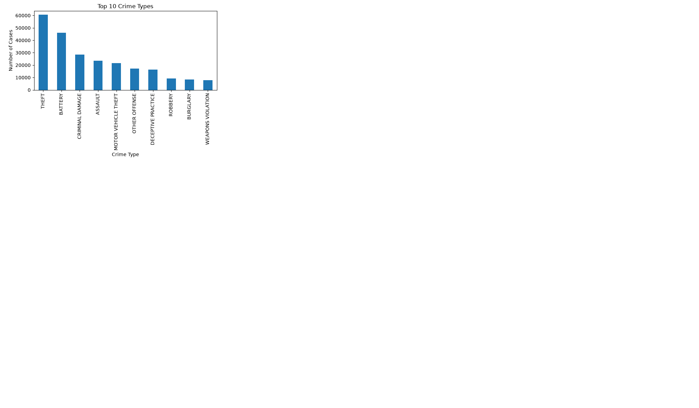
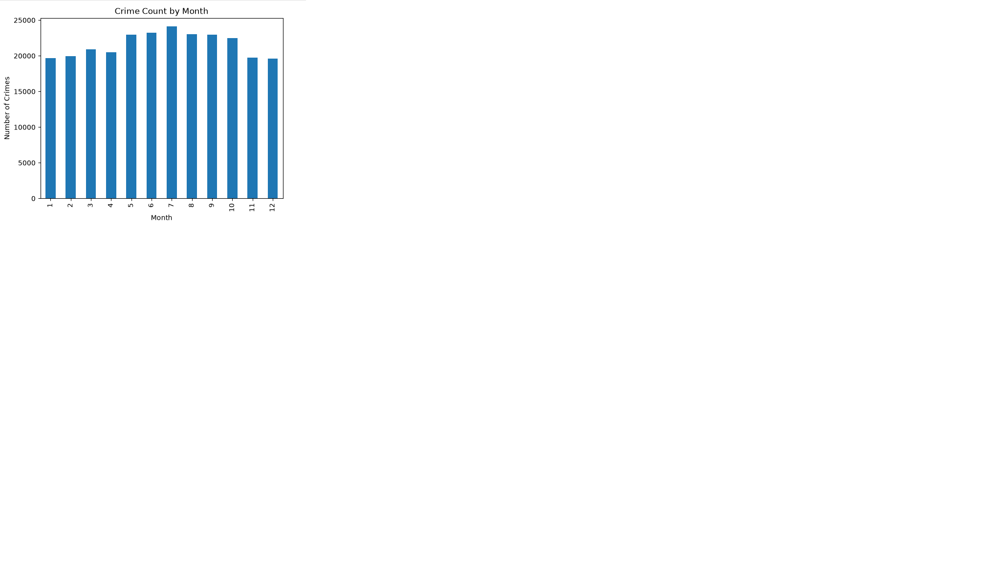
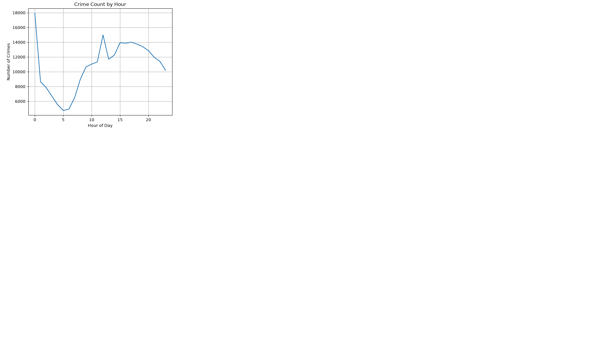
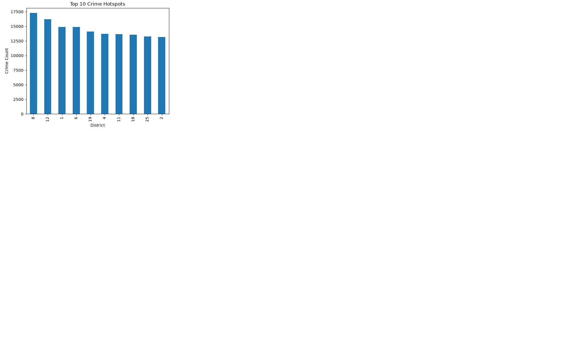

# AI Crime Analysis & Prediction System

## Overview

This project analyzes crime records and predicts crime categories using Machine Learning. The system performs crime trend analysis, visualization, hotspot detection, and crime prediction through a Flask web application.

## Features

- Crime Data Analysis
- Crime Trend Visualization
- Crime Hotspot Detection
- Machine Learning Prediction
- Flask Web Application
- Bootstrap Dashboard

## Technologies Used

- Python
- Pandas
- NumPy
- Matplotlib
- Scikit-Learn
- Random Forest Classifier
- Flask
- Bootstrap
- Jupyter Notebook

## Screenshots

### Top Crime Types

### Monthly Crime Trend

### Hourly Crime Trend

### Crime Hotspots

## Project Structure

AI-Crime-Analysis-and-Prediction-System

├── app/

├── screenshots/

├── crime_analysis.ipynb

├── README.md

└── .gitignore

## Future Improvements

- Improve prediction accuracy
- Add more predictive features
- Interactive dashboard
- Online deployment

## Author

Sanket Kotak

B.Tech Computer Engineering

AI/ML Enthusiast
